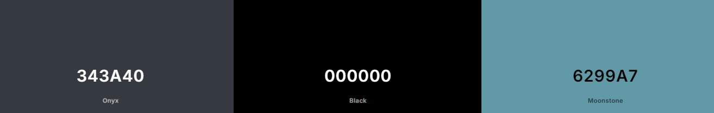

# The Wolfe Emporium
The Wolfe Emporium is an online bookstore dedicated to acclaimed fantasy and sci-fi writer Gene Wolfe

Despite a decades-spanning career and several impressive achievements, the works of Gene Wolfe rarely receive reprints, leaving fans to either search out second-hand copies of his work or buy them digitally, which is not ideal for many collectors. Due to their quasi-rarity, editions in good condition can be resold at prices far higher than the standard second-hand book.

The Wolfe Emporium aims to fix that by reprinting Wolfe's bibliography and providing them to the public at very reasonable, set prices. The aim is to also provide promotional materials and stock to any interested booksellers in order to futher foster interest in his masterful works.

[Live Deployment](https://the-wolfe-emporium-bde6dff49b20.herokuapp.com/)

# Design & Planning
## User Stories
-As a user I want to
  - Easily and intuitively navigate the site
  - Browse the selection and inspect for further details
  - Add books to cart
  - Place an order
  - Register an account to track orders
  - Save my details for future orders

The above will be addressed under Testing below

## Wireframes
The wireframes for this website were designed using Figma and were mostly adhered to throughout. 

The following bootstrap themes served as a customised basis in places to allow further attention to be placed on the code:
  - The Carousel theme was used for the Home Page
  - The Static Navbar theme was used for the Nav Bar
  - The Checkout theme was used for the Checkout page

### Wireframes For Home

### Wireframes For Book Store

### Wireframes for Book Details

## Agile Methodology
This website was designed using an Agile Methodology. Features for this project were planned ahead of time and tracked using a Kanban Board which was hosted on the programmers Github profile.

This can be seen [here](https://github.com/users/AdamFcode/projects/3/views/1)

## Typography
Turret Road and Dancing Script were the two fonts selected for headings throughout, with the standard font used for paragraphs. The two chosen fonts were selected for their aesthetic connections to the fantasy and sci-fi genre. Not only was Gene Wolfe lauded in both genres, he was also known for blending the two or misleading readers to believe the current work they were reading was situated in one genre whilst in fact being the other on closer inspection.

## Colour Scheme
The colour scheme was selected following a discussion with a artist familiar with Gene Wolfe's work. The darker tone of the navbar and footer is seperated by a soft blue. Initially, white was selected for the text in the body, similar to the navbar, but it caused issues with readability. As such, black was chosen as it stood out starkly against the blue.

### Colour Palette

## Database Schema

# Technologies Used

# Features
## Navbar
The top of the website has a navbar providing links to the various pages of the store. It also hosts an account drop-down menu and access to the user's cart. A search bar allows the user to search for specific titles or categories and a banner informs the user that all orders have free delivery. Free Delivery was decided upon based on the massive popularity of the now defunct bookstore, bookdepository.com, which was a great source of Gene Wolfe novels and often edged out the competitions total price due to free delivery alone.

## Carousel
A carousel at the top of the homepage offers three segments, each with a brief description of a specific page on the site and a button to access the same. They are also accompanied by a relevant image.

## Featurettes
The homepage also features three featurette's, eachdiscussing a specific aspect of the website; the price plan, the fresh printing of the Wolfe bibliography and a commitment to upholding the legacy of Gene Wolfe. each of these featurettes is accompanied by a relevant image.

## Newsletter
The footer on the homepage hosts a newsletter signup form provided by mailchimp. The form only exists inthe footer on the homepage as it is the largets element of the footer and felt like aggresive marketing if hosted at the bottom of every page.

## Footer
The standard footer for the website contains a simple copyright statement for the programmer, a link to the website's facebook page and a link to bring the user back to the top of the current page.

## Bookstore
The page for books displays them as cards, aligned four horizontally on desktop and stacked singularly on mobile. The card contains the book's image, it's name, date of publication, price and category. The user can sort the results with a dropdown menu above the bookstore and can click on either the image or the book name to see further details.

## Book Detail
Clicking into a book provides the same information as above, along with a description of the book's content. On mobile, the book image is hidden as it necessitated the user scrolling to receive all the pertinent information. Here the user can also select a quantity and add it to their cart if they wish.

## Partner Contact Form
The partner contact form, accessible from both the navbar and the carousel, provides interested booksellers with a form which gathers basic information about their business. This is hypotethically to form a partnerhsip where The Wolfe Emporium would provide stock and promotional materials to interested booksellers in order to increase awareness in Gene Wolfe's work. 

## Mission Statement
The mission statement page, accessible from both the navbar and the carousel, contains three seperate chunks of content, each headed with a quote from Gene Wolfe's texts and a relevant image. This page provides information on Gene Wolfe himself as well as the intents of The Wolfe Emporium.

# New User Workflow
## Registration
A user who wishes to register for the website would do so through the account menu in the navbar.

Once on the registration page, the user will be asked to provide some basic details.

Following registration a confirmaton email will be sent to the user's account. A toast at the bottom of the screen will also appear.

An email sent to the user provides a link to activate their account. This ensures a rudimentary protection against bots making sham accounts, though further precautions would be ideal.

Once the link in the email has been clicked, the user will be rerouted to a page to confirm their successful registration by pressing a button. On doing so, they receive an informative toast.

The user will then be asked to login using their registered details. Once logged in, a toast will greet them once again.

When a user adds a book from the bookstore to their cart, they receive a toast to inform them of the change. With books in their cart, they can now access it from either the navbar or from a button on the book details page. The cart hosts the selected books with a summary total for the order.

Within the cart, the user has access to an update and a remove button, with which they can control the quantities and items they wish to purchase. Any usage of these buttons is accompanied by a toast to keep the user updated on any changes to their cart.

Once the secure checkout button in cart is clicked, the user is brought to the checkout page, which contains a summary of their cart and provides a form for them to fill out their personal details, such as name, address and number.

A payment element under the details form, provided by stripe, allows the user to enter their card details and proceed with their purchase. Incorrect data entry or any processing errors will be made clear to the user.

