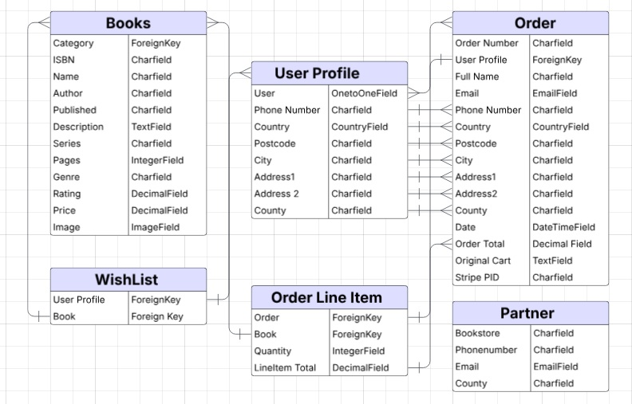
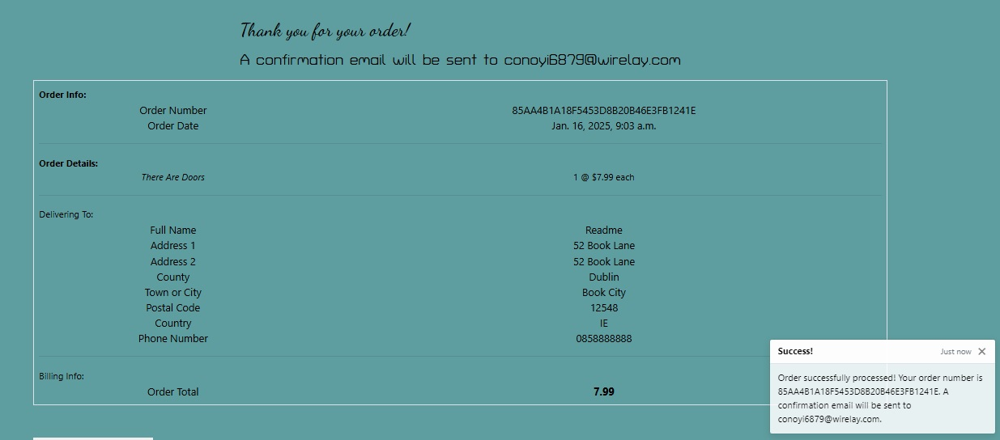
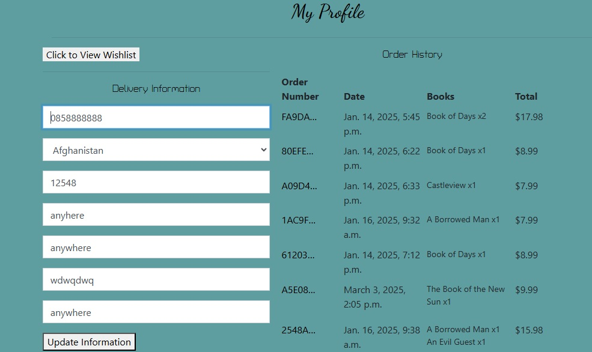

# The Wolfe Emporium
The Wolfe Emporium is an online bookstore dedicated to acclaimed fantasy and sci-fi writer Gene Wolfe

Despite a decades-spanning career and several impressive achievements, the works of Gene Wolfe rarely receive reprints, leaving fans to either search out second-hand copies of his work or buy them digitally, which is not ideal for many collectors. Due to their quasi-rarity, editions in good condition can be resold at prices far higher than the standard second-hand book.

The Wolfe Emporium aims to fix that by reprinting Wolfe's bibliography and providing them to the public at very reasonable, set prices. The aim is to also provide promotional materials and stock to any interested booksellers in order to futher foster interest in his masterful works.

[Live Deployment](https://the-wolfe-emporium-bde6dff49b20.herokuapp.com/)

# Design & Planning
## User Stories
-As a user I want to
  - Easily and intuitively navigate the site
  - Use the search bar to locate books
  - Browse the selection and inspect for further details
  - Add, edit and remove books within my cart
  - Place an order
  - Safely register an account to track orders
  - Save my details for future orders

The above will be addressed under Testing below

## Wireframes
The wireframes for this website were designed using Figma and were mostly adhered to throughout. 

The following bootstrap themes served as a customised basis in places to allow further attention to be placed on the code:
  - The Carousel theme was used for the Home Page
  - The Static Navbar theme was used for the Nav Bar
  - The Checkout theme was used for the Checkout page

### Wireframes For Home

### Wireframes For Book Store

### Wireframes for Book Details

## Agile Methodology
This website was designed using an Agile Methodology. Features for this project were planned ahead of time and tracked using a Kanban Board which was hosted on the programmers Github profile.

This can be seen [here](https://github.com/users/AdamFcode/projects/3/views/1)

## Typography
Turret Road and Dancing Script were the two fonts selected for headings throughout, with the standard font used for paragraphs. The two chosen fonts were selected for their aesthetic connections to the fantasy and sci-fi genre. Not only was Gene Wolfe lauded in both genres, he was also known for blending the two or misleading readers to believe the current work they were reading was situated in one genre whilst in fact being the other on closer inspection.

## Colour Scheme
The colour scheme was selected following a discussion with a artist familiar with Gene Wolfe's work. The darker tone of the navbar and footer is seperated by a soft blue. Initially, white was selected for the text in the body, similar to the navbar, but it caused issues with readability. As such, black was chosen as it stood out starkly against the blue.

### Colour Palette

## Database Schema

# Technologies Used

# Business Model
  - The Wolfe Emporium is a business-to-consumer(B2C) website that sells reprints of Gene Wolfe's bibliography at a reasonable price.
  - The partner form allows for business-to-business(B2B) transactions; The Wolfe Emporium offers stock and promotional materials to booksellers at wholesale prices, though the transaction itself if handled off-site once interest is indicated by a bookseller.
  - Exclusive contracts with the Wolfe estate ensure access to stock as long as The Wolfe Emporium pays for rights and the physical printing of the books.
  - The Wolfe Emporium is supported by a dedicated staff who are keen fans of Gene Wolfe.

# Marketing
  - A newsletter has been implemented via mailchimp, allowing customers to sign-up for any updates in regards to stock or sales.
  - A facebook page has been created to promote the business on social media, available [here](https://www.facebook.com/profile.php?id=61571933733644)

Below is a screenshot of the Facebook page:

# Features
## Navbar
The top of the website has a navbar providing links to the various pages of the store. It also hosts an account drop-down menu and access to the user's cart. A search bar allows the user to search for specific titles or categories and a banner informs the user that all orders have free delivery. Free Delivery was decided upon based on the massive popularity of the now defunct bookstore, bookdepository.com, which was a great source of Gene Wolfe novels and often edged out the competitions total price due to free delivery alone.

## Carousel
A carousel at the top of the homepage offers three segments, each with a brief description of a specific page on the site and a button to access the same. They are also accompanied by a relevant image.

## Featurettes
The homepage also features three featurette's, eachdiscussing a specific aspect of the website; the price plan, the fresh printing of the Wolfe bibliography and a commitment to upholding the legacy of Gene Wolfe. each of these featurettes is accompanied by a relevant image.

## Newsletter
The footer on the homepage hosts a newsletter signup form provided by mailchimp. The form only exists inthe footer on the homepage as it is the largets element of the footer and felt like aggresive marketing if hosted at the bottom of every page.

## Footer
The standard footer for the website contains a simple copyright statement for the programmer, a link to the website's facebook page and a link to bring the user back to the top of the current page.

## Bookstore
The page for books displays them as cards, aligned four horizontally on desktop and stacked singularly on mobile. The card contains the book's image, it's name, date of publication, price and category. The user can sort the results with a dropdown menu above the bookstore and can click on either the image or the book name to see further details.

## Book Detail
Clicking into a book provides the same information as above, along with a description of the book's content. On mobile, the book image is hidden as it necessitated the user scrolling to receive all the pertinent information. Here the user can also select a quantity and add it to their cart if they wish.

## Partner Contact Form
The partner contact form, accessible from both the navbar and the carousel, provides interested booksellers with a form which gathers basic information about their business. This is hypotethically to form a partnerhsip where The Wolfe Emporium would provide stock and promotional materials to interested booksellers in order to increase awareness in Gene Wolfe's work. 

## Mission Statement
The mission statement page, accessible from both the navbar and the carousel, contains three seperate chunks of content, each headed with a quote from Gene Wolfe's texts and a relevant image. This page provides information on Gene Wolfe himself as well as the intents of The Wolfe Emporium.

# New User Workflow
## Registration
A user who wishes to register for the website would do so through the account menu in the navbar.

Once on the registration page, the user will be asked to provide some basic details.

Following registration a confirmaton email will be sent to the user's account. A toast at the bottom of the screen will also appear.

An email sent to the user provides a link to activate their account. This ensures a rudimentary protection against bots making sham accounts, though further precautions would be ideal.

Once the link in the email has been clicked, the user will be rerouted to a page to confirm their successful registration by pressing a button. On doing so, they receive an informative toast.

The user will then be asked to login using their registered details. Once logged in, a toast will greet them once again.

When a user adds a book from the bookstore to their cart, they receive a toast to inform them of the change. With books in their cart, they can now access it from either the navbar or from a button on the book details page. The cart hosts the selected books with a summary total for the order.

Within the cart, the user has access to an update and a remove button, with which they can control the quantities and items they wish to purchase. Any usage of these buttons is accompanied by a toast to keep the user updated on any changes to their cart.

Once the secure checkout button in cart is clicked, the user is brought to the checkout page, which contains a summary of their cart and provides a form for them to fill out their personal details, such as name, address and number.

A payment element under the details form, provided by stripe, allows the user to enter their card details and proceed with their purchase. Incorrect data entry or any processing errors will be made clear to the user.

Once the user has clicked on secure payment, they will be redirected to a page documenting the contents of their order and displaying a toast to keep the user informed, whether to tell them that a confirmation email has been sent or, in the case of visiting a past order page, that the confirmation email had already been sent at the time of the original purchase.

Stripe webhook event deliveries are fully operational

Having placed a successful order, the user receives a confirmation email as can be seen in our temporary email address below

If a registered user wishes to review all their past orders, they can access their profile from the account drop-down in the navbar. Once they navigate to this page, they can either update their personal details or review their past orders in a table. The order number on this table can be clicked to bring the user to the specific instance of that order, as detailed in the step above

# Testing
## User Stories
As a user I want to easily and intuitively navigate the site
  
  - The navbar works and is easy to use, displaying the correct options depending on user status.
  - The carousel provides buttons that lead to the main areas of the website.
  - Buttons across the site lead to their intended destination

As a user I want to use the search bar to locate books

  - The search bar allows the input of queries, searching through titles and categories to locate a match.
  - Upon entering a search term, the page redirects to the bookstore page with the relevant items displayed.

As a user I want to browse the selection and inspect for further details
  
  - The bookstore is accesible both to registered users and guests.
  - The detail cards in the bookstore provide two clickable sources which lead to the detailed page for each individual book.
  - The book details page provides all the necessary information for the book, such as name, description, price and category

As a user I want to add, edit and remove books within my cart
  
  - The relevant buttons for performing these tasks are operational and available to the user in multiple places.

As a user I want to place an order

  - The user is able to put together an order and control its contents thereafter
  - A form is provided for the user to submit their details such as address
  - The user is provided with a protected means of making a payment in exchange for the order

As a user I want to safely register an account to track orders

  - The navbar menu provided a portal for the user to register an account
  - The registration is protected by email verification
  - Once registered, the user has access to a profile which tracks their orders and provides details for each at a click

As a user I want to save my details for future orders

  - The profile page allows the user to enter their details and save them, calling them automatically in the relevant forms thereafter
  - Upon placing an order, the user can tick a box to automatically update their personal details from the order form

## Manual Testing
### Navigation
**Task**: Navigate website

**Steps**: Selected each option along the navbar from every app to ensure that they led to the intended pages.

**Status**: Success.

### Registration
**Task**: Register as User

**Steps**: Clicked on Account in navbar. Filled out the form following the guidelines and confirmed email.

**Status**: Success

### Logout
**Task**: Logout successfully 

**Steps**: Clicked on logout under account in navabar. Presented with confirmation button. Upon clicking on button, redirected to homepage and given toast to confirm logout.

**Status**: Success

### Login
**Task**: Login successfully 

**Steps**: Clicked on login in navbar. Filled out form with relevant information. Was redirected to homepage and notified of successful login. Could comment as logged in user.

**Status**: Success

### Populate Cart
**Tasks**: Fill order

**Steps**: Added various books to cart and then navigated to checkout. The selected books were present and ready for purchase.

**Status**: Success

### Place Order
**Tasks** Place order and provide payment

**Steps** From the checkout page filled in fom and provided payment details. Clicked to place order and received confirmation of same.

**Status**: Success

### Custom Error 404
**Tasks**: Verify whether the custom 404 page is working.

**Steps**: Navigated to a non-existant page on the website. Was greeted by the custom error 404 document upon landing there.

**Status**: Success

## Validator Testing
### CSS
Css was tested using the official Jigsaw validator and returned no errors.

### HTML
The HTML was tested on the official W3 Validator and returned one error in the cart page

Another resource was used to try to identify where the unclosed tags were. This then returned no errors. Manual trawling of code failed to find the errors and as such the file was left as it was. Below is the validation from the other resource.

The remaining html pages passed the validation with no issues:

### Python
The Code Institute Python Linter was used to test the various python files across the project. 

Commonly raised errors where trailing whitespaces, overly long lines, mising newlines and less blank lines than expected. These issues were corrected in the relevant files.

The following is a list of the apps and the relevant python files that were scanned within each. Any app-specific issues are covered underneath the app, with these specific issues remaining for final build as fixing them caused errors as detailed below:

**Books App**: admin.py, apps.py, forms.py, models.py, test.py, urls.py, views.py
  - A line in views.py was too long. It could be fixed with no errors in the pylint but once the same fix was applied to the workspace, it ceased to work properly. Seevral means of breaking up the line were attempted and each broek functionality.

**Cart App**: apps.py, contexts.py, test.py, urls.py, views.py
  - An import at the top of views.py was overly long. However, breaking it into two lines caused another error with the following import(module import not at top of file).

**Checkout App**: admin.py, apps.py, forms.py, models.py, signals.py, test.py, urls.py, views.py, webhooks.py, webhook_handler.
  - An import at the top of views.py was overly long. However, breaking it into two lines caused another error with the following import(module import not at top of file).
  - Webhookhandler.py had four lines too long which could not be divided without breaking the functionaliy of the webhooks.

**Home App**: apps.py, urls.py, views.py

**Profile App**: apps.py, forms.py, models.py, urls.py, views.py
  - Forms.py had a line that was too long. However, any attempt at dividing it onto the following line led to the functionality of the form failing.

### Javascript
JShint was used to test the various javascript functions throughout the website.

Mostly successful throughout, the test called for semi-colons to be added in several places which were adhered to immediately. 

The only remaining error throughout the javascript was $ not being defined. After some troubleshooting online, it was decided to leave the error as it seems a common problem that occurs when testing jQuery with JShint and the $ symbol did not cause any errors when in practice on the live site.

## Lighthouse Testing
The lighthouse testing was satisfactory throughout all pages on desktop, with the lowest scoring page's(the homepage) results below:

Testing on mobile was not as satisfactory. An initial test performed immediately after deployment showed green across the board. Changes were made to the project following that test which affected the performance. This was not seen until a test was performed the night prior to submission deadline. Due to unforseen cicumstances, much of the project had to be finalised on the night prior to submission. In weighing the various elements that required attention, it was decided to accept the unsatisfactory scores and earmark the issue as a top priority task in a future build. The lighthouse score for the lowest scoring mobile page(the homepage) is below:

## Bugs
A number of weeks prior to deadline there was an issue where webhooks were not being delivered. Troubleshooting and tutor-support led to a switching of python versions in the project which fixed the issue with the webhooks.

This, however, led to a chain of issues which took up most of the developmental time of the project. Due to the change in python version, some syntax was outdated which caused errors. To compound the issue, the pyenv reset itself every time the workspace was closed despite being installed and declared in python-version document. This meant that the specific python package had to be installed at the start of each session and then set to the shell, an issue which was given at least an hour of troubleshooting most days of development. Course tutors and facilitators were of great help with this issue, and after roughly a fortnight of constant tinkering at the packages level, the issue was solved by uninstalling several packages and reinstalling different versions of the same.

However, this led to an error on the deployed site due to dj-database-url no longer properly interacting with the other existant package. Thankfully, this issue was solved very quickly with aid from the course facilitator, who helped troubleshoot and identify dj-database-url as the source of the problem. Once the package was updated to the correct version, the issues disappeared.

A valuable lesson was learned in regards to package installation and being mindful of the versions that are being installed and how it is they interact with each other, what syntax they demand of one another and which is necessary to ensure proper function of the other.

# SEO Implementation:
A robots.txt file and sitemap.xml file were added to the repository to aid in search engine optimisation. The descriptive meta tags in the head were as follows:

**Keywords**: Books, Gene Wolfe, Prices, Free Delivery, Partnership, Fiction, Short Stories, Omnibuses, Collections, Emporium, Pringles Designer, Severian, BOTNS, Wizard Knight, Litany Sun, Cerberus, Promotion, Fantasy, Sci-Fi, Literature, Booksellers, Award

**Description**: A reasonably priced bookstore dedicated to award-winning fantasy and sci-fi author Gene Wolfe, offering free delivery and partnership opportunities for booksellers.

# Deployment
The app was deployed on Heroku following these steps:
  - Created a new app in heroku account with unique name
  - Linked the app to the relevant gitpod repository
  - Created Postgres account, acquired a database url and pasted it into config vars on Heroku.
  - Provided pertinent information directly through the environ on both heroku and within the repository, such as secret keys and other data sensitive materials.
  - Connected to the database from within the IDE and then migrated all relevant models to be accessible on the Heroku app.
  - Ensured that DEBUG was set to false before deploying to Heroku.
  - Added a procfile to repository to provide gunicorn functionality.
  - Organised static material into relevant folders and uploaded same to an AWS bucket.
  - Used template tags to populate static files from the AWS bucket onto the deployed site.
  - Navigated to Heroku and deployed the branch manually.
  - Monitored build log for errors
  - Set Heroku to auto-build with every commit from gitpod.
  - Ensured all config vars and environmental variables were correct before opening app from Heroku dashboard.
  - Confrimed successful deployment of app.

# Credits
## Content
  - The Boutique Ado walkthrough proved an invaluable guide for this project, inspiring the code and providing a clear pathway for the implementation of an ecommerce project.
  - Bootstrap provided themes which were then customised to suit the needs of the website.
  - Book descriptions were sourced from Wikipedia and Goodreads, with edits applied by the programmer for brevity.

## Media 
  - All book images were sourced from Goodreads or AbeBooks.
  - Supporting pictures were sourced from either the Gene Wolfe subreddit or from the Goodreads Gene Wolfe fan-club.
  - Tiny PNG was used to compress the images.

## Special Thanks
- Tutors, mentors, classmates et al at Code Institute, particularly the facilitator Marko who helped immensely with troubleshooting issues and consistently provided valid reccomendations when the means of advancing were unclear.
- The Code Institute slack community
- The community at Stack Overflow

  

